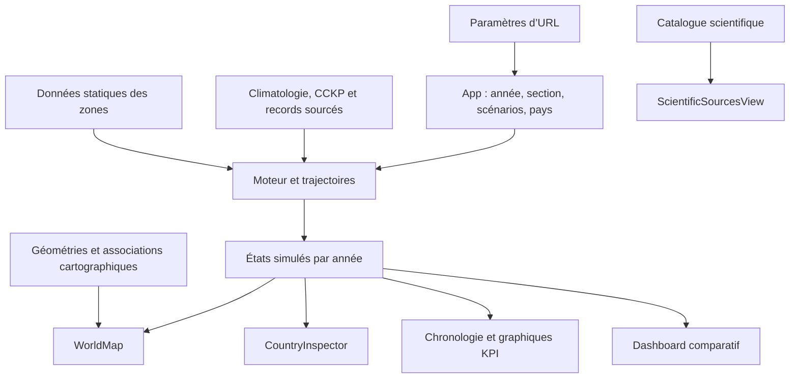

# Architecture et fonctionnement du site CLIMATOPEDY

Ce document décrit la structure réellement implémentée. Les identifiants des six sections principales sont définis dans `src/data/siteSections.ts` et testés dans `tests/siteStructure.test.ts`. Une évolution volontaire reste possible ; les changements qui touchent à la structure doivent mettre à jour ce contrat, le test et ce guide.

## Vue d’ensemble

CLIMATOPEDY est une application monopage React et TypeScript, assemblée avec Vite. `src/main.tsx` monte `App`. `src/App.tsx` détient l’état global de navigation et de simulation, calcule les trajectoires puis transmet l’état actif aux pages et aux contrôles. `src/components/TopBar.tsx` fournit la navigation desktop/mobile et les actions générales.

Il n’y a pas de routeur par URL pour les pages : `currentTab` choisit la section rendue dans `App`. Le contrat `SITE_SECTIONS` liste les sections, leurs libellés desktop/mobile et leur vue principale. `AppTabType`, exporté par `TopBar.tsx`, est dérivé de ces identifiants.

## Sections principales

| ID stable | Vue principale | Rôle |
| --- | --- | --- |
| `map` | `WorldMap` et modules de la page Carte | Explorer les indicateurs par zone, la chronologie, les scénarios, les graphiques et les explications. |
| `comparative-dashboard` | `ComparativeDashboardView` | Comparer les sorties des trajectoires A et B à l’année choisie. |
| `tipping-points` | `TippingPointsView` | Explorer le dossier des points de bascule en fonction de l’année et du réchauffement simulé. |
| `causal` | `CausalChainExplorer` | Explorer les chaînes matérielles et énergétiques du modèle. |
| `spec` | `SpecModal` | Lire les formules et la description technique du modèle. Malgré son nom historique, ce composant est rendu comme une section de page dans l’application. |
| `sources` | `ScientificSourcesView` | Parcourir les publications, jeux de données et sources du site ; la vue peut aussi demander une navigation vers une autre section. |

### Page Carte (`map`)

`App.tsx` compose les éléments suivants dans cet ordre général :

1. `ClimatopedyHeader` : objectif et accès au tutoriel.
2. `WorldMap` : planisphère, couches biophysiques, sélecteur d’indicateur, survol et carte d’analyse du territoire.
3. `TimelineController` : lecture, pause, vitesse, année courante et sauts vers des jalons.
4. `ComparisonModePanel` : réglages de comparaison et paramètres de la trajectoire B.
5. `KpiCharts` : graphiques synchronisés avec la chronologie et comparaison facultative.
6. `YouthExplainerCard` : explication pédagogique.
7. Une carte d’accès au dossier des points de bascule.
8. `FutureConclusionCard` : synthèse à des années futures.
9. `InteractiveFaqSection` : FAQ et lexique intégrés à la page.
10. `AiFutureDebateCard` : module de discussion autour du futur.
11. Une carte d’accès à la vue Sources & Données.

`CountryInspector` est un panneau latéral global monté par `App`; il reçoit le pays sélectionné et l’état de simulation courant. Le record absolu de température est uniquement rendu dans ce panneau. Il reste visible jusqu’en 2026 inclus et est masqué pour toute année ultérieure, car il s’agit d’une observation historique et non d’une projection. La carte d’analyse interne à `WorldMap` n’affiche pas ce record.

La FAQ dans la barre supérieure choisit la section Carte puis défile jusqu’à l’ancre `faq-section`. Le tutoriel desktop et l’avertissement mobile sont des fenêtres contextuelles, pas des sections supplémentaires. Le menu mobile reproduit les six sections et ces accès d’aide.

## État partagé et interactions

`App.tsx` est propriétaire des états suivants :

- `currentTab` : section affichée ; cette sélection n’est pas encodée dans l’URL.
- `selectedCountryId` : pays épinglé dans la carte, transmis à `WorldMap` et `CountryInspector`.
- `currentYear`, `isPlaying` et `playbackSpeed` : temps courant et lecture animée. Les contrôles de chronologie peuvent déplacer l’année entre 1900 et 2200.
- `scenarioA` et `scenarioB` : scénarios de référence et de comparaison ; les trajectoires sont calculées avec `generateFullTrajectory` et mémorisées par `useMemo`.
- `isCompareMode` et `customParams` : activation de la comparaison et paramètres réglables du scénario B.
- `sharedConfigLoaded` : bannière indiquant qu’un paramétrage a été importé depuis un lien.
- `isMobileNoticeOpen` et `isTutorialOpen` : visibilité des aides contextuelles.

La trajectoire A alimente l’état principal de la carte et des KPI. Les deux trajectoires sont transmises au tableau comparatif et aux graphiques lorsque le mode de comparaison est actif. L’année décimale sert à l’animation ; la recherche d’un état pré-calculé utilise son année entière. Le pays actif associe cet état dynamique aux métadonnées statiques du pays.

`TimelineController` signale les actions temporelles à `App`. `ComparisonModePanel` signale les changements de comparaison et les paramètres B. `TopBar` demande le changement de section ou la réinitialisation de l’année de départ. Les vues ne possèdent pas leurs propres copies des trajectoires globales.

## Partage par URL

`src/utils/urlParams.ts` décode les paramètres de recherche au démarrage et synchronise ensuite le scénario B et l’année avec l’URL via `history.replaceState`, sans rechargement. Les clés actuellement prises en charge sont :

- `scenB` : identifiant du scénario B ;
- `oilRed` : taux de réduction de la demande de pétrole ;
- `agro` : adoption de l’agroécologie ;
- `resil` : facteur de résilience ;
- `ecs` : sensibilité climatique ;
- `year` : année de simulation.

Les paramètres numériques sont bornés lors du décodage. L’URL ne conserve pas la section active ni le pays sélectionné. Les liens partageables reprennent les paramètres de scénario et l’année.

## Données et calculs

### Simulation et états historiques

- `src/data/countriesData.ts` fournit les paramètres statiques utilisés par le moteur pour les 34 zones.
- `src/data/cckpCountryTemperatures.json` et `src/data/climatePanelData.json` alimentent les séries thermiques et les valeurs de référence du panneau chaleur. `src/data/verifiedTemperatureRecords.ts` contient les records observés sourcés ou indique leur indisponibilité.
- `src/data/worldMapGeo.ts` fournit les géométries et associations entre pays cartographiques et zones simulées.
- `src/engine/physicsModel.ts`, `src/engine/countryTemperatures.ts`, `src/engine/historicalData.ts` et `src/engine/simulationRunner.ts` génèrent les états historiques et futurs consommés par la carte, le panneau pays et les graphiques.
- `src/types/simulation.ts` décrit les états globaux et par pays. `src/types/climatePanel.ts` décrit les données climatiques et leur provenance.

Les données bibliographiques de la vue Sources & Données sont décrites dans `src/components/ScientificSourcesView.tsx`. Les explications d’incertitude du modèle sont dans `ModelConfidenceGuide` et les éléments pédagogiques sont répartis dans les composants de page.

### Résumé du flux



## Contrat de structure et harnais de régression

Le harnais actuel est constitué de tests Node intégrés à `npm test` :

- les IDs de `SITE_SECTIONS` doivent être uniques et correspondre aux six sections documentées ;
- chaque section doit rester raccordée aux libellés desktop/mobile de `TopBar`, à une branche de rendu dans `App` et à sa vue principale ;
- la page Carte doit conserver ses points d’entrée majeurs : `WorldMap`, `TimelineController`, `ComparisonModePanel` et `KpiCharts` ;
- le statut d’habitabilité et la visibilité des records doivent rester raccordés à leurs règles partagées ;
- les métriques de températures annuelles affichées sur la carte doivent suivre l’année de l’état simulé ;
- toute Tw hors du domaine publié de la formule de Stull reste indisponible et ne produit pas d’alerte thermique ;
- ce guide doit couvrir les sections, les principaux composants, les paramètres d’URL et les commandes de vérification.

Ces tests protègent des contrats structurels sélectionnés ; ils ne figent pas le HTML complet, les styles CSS ou tous les textes. Il n’y a pas actuellement de test navigateur ni de référence de captures d’écran.

Les températures annuelles 2026 sont ancrées aux moyennes NASA POWER/MERRA-2 du point représentatif pour la moyenne, la moyenne des minima quotidiens et celle des maxima quotidiens. Les deltas nationaux CCKP/CMIP6 sont ensuite ajoutés séparément à chaque série; la carte et la fiche lisent les extrema de l’année simulée. Les reconstructions passées appliquent l’anomalie historique de la moyenne aux extrema de référence. Pour Tw, les entrées en dehors de Ta −20 à 50 °C ou de 5 à 99 % d’humidité rendent le calcul indisponible; ces cas sont omis des seuils thermiques et ne sont pas présentés comme des valeurs sûres.

### Liste de contrôle avant de modifier la structure

1. Décider si la modification change les six sections, leur ordre, leurs libellés ou leurs vues principales.
2. Mettre à jour `SITE_SECTIONS` et les branchements de `TopBar`/`App` si nécessaire.
3. Préserver ou modifier explicitement les responsabilités de l’état partagé et les données transmises entre vues.
4. Mettre à jour les contrats et tests dans `tests/siteStructure.test.ts`.
5. Mettre à jour l’inventaire et les flux de ce document.
6. Exécuter les tests, le contrôle TypeScript et le build avant de fusionner.

## Vérification locale

Depuis la racine du dépôt :

```powershell
npm test
npm run lint
npm run build
```

Les tests utilisent le runner Node et `tsx`. `npm run lint` exécute le contrôle TypeScript (`tsc --noEmit`) et `npm run build` assemble l’application Vite pour la production.
